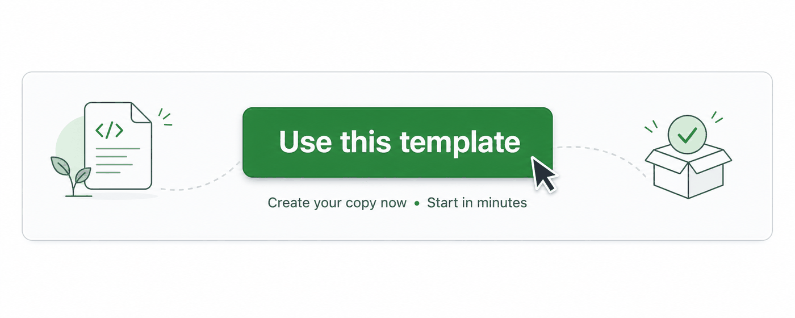

# 🔬 Auto Research

🌐 **English / 日本語** — **English (this page)** ・ [日本語](README.ja.md)

[](LICENSE)
[](.github/workflows/auto-research.yml)
[](https://github.com/anthropics/claude-code-action)




**Wake up to a fresh research briefing in your GitHub repo, every morning —
written by Claude, grounded in real web sources.**

*For research labs, AI/ML teams, and anyone who wants to keep up with a moving
field without doing the daily reading sweep by hand.*

> 🧭 Built for **researchers** first — but the same engine works just as well as a
> daily **tech / business / hobby / finance** tracker. It picks the right lens per
> topic (see [`config/domains/`](config/domains/)). More on that [below](#1-choose-what-it-researches).

Auto Research is a **GitHub repository template**. You click *"Use this
template"*, add one Claude credential, and from then on a scheduled job
web-searches your research topic each day and files the results as **GitHub
Issues** you can read, comment on, and close like any other.

There is **no server to run and no code to write**. Everything happens inside
GitHub Actions, which is free for public repos.

---

## ▶️ Watch the 5-minute setup

A click-by-click walkthrough — *Use this template → enable Actions → generate a
Claude token in your terminal → add it as a secret → Run workflow* — ending with
the Issues it files every morning, the 👍/👎 feedback loop, and the Slack post:


> 🎞️ Prefer full quality? **[Download the MP4](docs/tutorial.mp4).** The clip is
> styled after GitHub's own [Primer](https://primer.style) design system.

---

## What you get

Every day, for each topic you care about, Auto Research runs **four jobs in
parallel** — and files **one Issue per item**, so each paper, hypothesis,
release, or page change is its own trackable Issue you can label, comment on, and
close independently:

| 📰 Research News | 💡 Hypotheses | 📚 Related Work | 👀 Site Watch |
| --- | --- | --- | --- |
| 3–6 recent papers, releases, and posts — each its own Issue with a real link, source, date, and one-line takeaway. | 3–5 concrete, testable, falsifiable hypotheses — each its own Issue with a rationale, an experiment to test it, and the main risk. | Real papers grouped by theme — each its own Issue, plus one Issue collecting the open gaps to chase. | Watches pages you list (e.g. the **Hacker News** front page) with a real headless browser ([Playwright](https://playwright.dev/)) and, whenever one changes, files an Issue summarising exactly what's new. |

The four are independent jobs you can switch on or off one by one — see
[Pick which jobs you want](#2-pick-which-jobs-you-want).

### Where it all lands — three outputs

Every item flows to up to **three destinations at once**, all from the same
schema-validated data:

| 🏷️ GitHub Issues | 🌐 GitHub Pages site | 💬 Slack |
| --- | --- | --- |
| The primary output: one Issue per item, **auto-tagged** with topical labels you can filter and triage — and 👍/👎 to steer the next run. | A rich **Astro + Starlight** docs site, rebuilt from every Issue and published to the `gh-pages` branch — searchable, dark-mode, with tags, reactions, and comments. | One line per item (or a per-section digest) to an Incoming Webhook. Each leads with a **public** link — its on-site page, else the real source URL — with the GitHub Issue only a secondary `↳` line. Optional — the webhook's presence is the switch. Mirror it to email with `RESEND_API_KEY` + `EMAIL_TO`. |

Each item looks like a normal Issue — titled and labelled, with clickable
sources — so it slots straight into how you already triage work on GitHub:

```
Research News: Self-RAG: Learning to Retrieve, Generate, and Critique …   [auto-research] [research-news]

Topic: Retrieval-augmented generation
Date: 2026-06-04

Source: arXiv · 2026-05
Link: https://arxiv.org/abs/…

Trains a model to decide *when* to retrieve, cutting needless lookups.
```

**Why it's trustworthy:** Claude only includes papers and links it actually
opened via web search. It is told never to invent a title, author, date, or URL
— when unsure, it leaves a field blank rather than fabricate a citation.

---

## ⚡ Quickstart — running in about 5 minutes

1. Click **"Use this template"** at the top of this repo and create your own copy.
2. Open the **Actions** tab in your new repo and click the button to **enable workflows**.
3. Get one Claude credential (pick whichever you have):
   - **Claude Pro/Max plan** → run `claude setup-token` locally, log in, and copy the token it prints.
   - **API billing** → grab an API key from [console.anthropic.com](https://console.anthropic.com).
4. Add it as a **Secret**: *Settings → Secrets and variables → Actions → Secrets → New repository secret.*
   - Name it `CLAUDE_CODE_OAUTH_TOKEN` (for the plan token) **or** `ANTHROPIC_API_KEY` (for the API key). You only need **one**.
5. *(Optional)* Set a **Variable** named `RESEARCH_TOPIC` to your topic — it defaults to `AI`.
6. Run it now: **Actions → Auto Research → Run workflow.** Check the new Issues, then let it run daily on its own.

> 💡 Until you add a credential, the scheduled run still **succeeds** and leaves
> a note telling you exactly what to add. Nothing breaks while you set up.

---

## What you can do — one capability at a time

Each of the following is something you turn on or change with a single GitHub
**Variable** or **Secret** (under *Settings → Secrets and variables → Actions*).
No code edits needed unless noted.

### 1. Choose what it researches

Set the `RESEARCH_TOPIC` **Variable** to anything — `Retrieval-augmented
generation`, `protein folding`, `RISC-V compilers`. It defaults to `AI`.

For richer, lab-specific results, also edit **`config/research_topics.md`** and
list your topics, datasets, constraints, and open questions. Claude reads this
file on every run for extra context.

**Point it at sources you trust.** List the feeds, blogs, and listing pages your
lab follows in **`config/priority_sources.md`** — one URL per bullet. Before its
open-ended web search, Claude **fetches those URLs first** and follows the
specific item links it finds on them, so your favourite sources get crawled
preferentially every run. They're priorities, not a whitelist: after exhausting
them Claude still searches freely for anything else new.

**Pick a domain (lens) — or let it choose.** A run isn't limited to academic
research: it can view your topic through one of five lenses — **research / tech /
business / hobby / finance** — each a plain Markdown guide under
**`config/domains/`**. By default the domain is `auto`: at the start of each run a
tiny picker reads the topic and chooses the best-fitting lens, and **remembers**
that choice for that topic (so it stays stable until you change the topic). You
normally set **no Variable** for this. To force one, set the `RESEARCH_DOMAIN`
Variable to `research`, `tech`, `business`, `hobby`, or `finance`. Whatever the
domain, each run still produces the same three layers — **Foundations** (the
unwavering facts), **Latest** (recent developments), and **Takes** (interpretations)
— and every research Issue is tagged `domain:<domain>` (the 👀 Site Watch Issues
are not domain-scoped).

### 2. Pick which jobs you want

Each is an independent job you can switch off:

| Variable | Controls | Default |
| --- | --- | --- |
| `ENABLE_RESEARCH_NEWS` | the 📰 News report | on |
| `ENABLE_HYPOTHESIS_GENERATION` | the 💡 Hypotheses report | on |
| `ENABLE_RELATED_WORK` | the 📚 Related Work report | on |
| `ENABLE_SITE_WATCH` | the 👀 Site Watch page-diff watcher | on |

Set one to `false` to skip it. Leaving it unset (or `true`) keeps it on. They all
run **in parallel**, so any subset works.

**Site Watch** is configured separately, in **`config/watch_targets.json`** — a
simple list of pages to watch (slug, name, URL, and an optional CSS `selector` to
track just part of the page). It ships watching the Hacker News front page; add
your own, or set `enabled: false` to pause one. Its snapshots are kept on the
unified `auto-research-state` orphan branch (not on `main`, shared with the domain
selection state) so each run diffs against the last without cluttering your main
history.

### 3. Write in English or Japanese

Set the `OUTPUT_LANGUAGE` Variable to `en` or `ja`. This switches both the
language Claude writes in **and** the headings/labels in the Issue. When you leave
it **unset**, the domain picker infers the most fitting language from the topic
(and remembers it per topic, like the domain). Anything unrecognised falls back to
English.

### 4. Get a Slack ping for each item

Add a **Secret** named `SLACK_WEBHOOK_URL` with a Slack
[Incoming Webhook](https://api.slack.com/messaging/webhooks) URL. Each item then
posts its own one-line message — led by its section emoji (📰 / 💡 / 📚) — with
its title and a link. No webhook, no post — there is no separate on/off flag,
the webhook's presence **is** the switch.

**The primary link is a public URL, not the GitHub Issue.** That's deliberate:
the site can be public even when the repo is private, and many readers never open
GitHub. So each line leads with, in order of preference:

1. the item's page on your published [docs site](#12-publish-a-rich-documentation-site-of-everything--automatically) — read live from the GitHub
   Pages API (the workflow carries `pages: read`), so it always matches wherever
   Pages serves: `/<repo>/`, root, or a custom domain; then
2. if Pages isn't set up, the **real curated source URL** — the actual paper /
   article / page the item is about; then
3. only as a last resort, the GitHub Issue.

The GitHub Issue is otherwise demoted to a small secondary `↳ GitHub Issue:`
line. So a reader always gets a link that works for them, even with no repo
access.

### 5. Get the same ping by email

Want each item in your inbox too? Add a **Secret** `RESEND_API_KEY` (a
[Resend](https://resend.com) API key) and a recipient `EMAIL_TO` (Variable or
Secret; comma-separate several). When **both** are present, every item that goes
to Slack is **also** emailed — same text, same digest/per-item behaviour — using
the exact same lines. Like the Slack webhook there is no separate on/off flag:
the presence of both values **is** the switch, so a run with neither stays
silent. By default the sender is Resend's shared test address
`onboarding@resend.dev` (which only delivers to your own Resend account until you
verify a domain); set `EMAIL_FROM` to your verified sender to reach anyone, and
`EMAIL_SUBJECT_PREFIX` to override the `[Auto Research] ` subject prefix.

### 6. Also save each item as a Markdown file

Set `ENABLE_FILE_OUTPUT=true` to *additionally* write one file per item,
`outputs/YYYY-MM-DD-<section>-<n>.md`, and upload them as a downloadable GitHub
Actions artifact. Off by default — Issues are the primary output.

### 7. Change when it runs

The default schedule is **once a day at 04:17 JST** (19:17 UTC). To change it,
edit the one `cron` line in `.github/workflows/auto-research.yml` (cron is always
in **UTC**):

```yaml
schedule:
  - cron: "0 22 * * *"   # 07:00 JST daily
  - cron: "17 19 * * 1"  # 04:17 JST on Mondays only
  - cron: "0 */12 * * *" # every 12 hours
```

Build your own at [crontab.guru](https://crontab.guru). You can always trigger a
run by hand from the **Actions** tab too.

### 8. Tune how Claude frames each report

Per-section guidance lives in **`config/prompts/`**:

- `hypothesis_generation.md` — how hypotheses are framed.
- `related_work.md` — how the literature is grouped.
- `watch_summary.md` — how Site Watch diffs are summarised.
- `labeling.md` — how the auto-labeler picks topical tags.
- `slack_summary.md` — notes for the Slack format.

Edit the prose to steer tone and emphasis. (To change the *shape* of the JSON
data itself, you'd also edit the `--json-schema` in the workflow and its
renderer in `scripts/publish_section.py` — see [Going further](#going-further).)

### 9. Adjust labels and the model

- `GITHUB_ISSUE_LABELS` — shared label(s) added to every Issue (default `auto-research`). Each report also gets its own tag (`research-news` / `hypothesis` / `related-work`).
- `ENABLE_GITHUB_ISSUE` — set to `false` to stop creating Issues (pair with `ENABLE_FILE_OUTPUT` to get files instead).
- `ANTHROPIC_MODEL` — override the Claude model (default `claude-sonnet-4-6`).

### 10. Set how many items each report posts

Set `ITEMS_PER_REPORT` (default `5`) to roughly how many items you want per
report. It's an **average** — Claude may land a few over or under. News and
hypotheses count as items directly; for Related Work it targets the total number
of papers across themes. Lower it for a tight daily digest, raise it for a wider
sweep.

### 11. Let it learn from feedback — and never repeat itself

Every run first summarises the Issues it already opened and tells Claude **not**
to propose anything already covered, so you get genuinely new material each day
instead of the same papers again.

You can also **steer** the next run with one click: react 👍 or 👎 on any past
Issue (or add a `good` / `bad` label). Claude then produces *more* like the 👍
ones and *avoids* the 👎 ones. Tune it with optional Variables:

- `EXISTING_CONTEXT_MAX` — how many prior Issues to summarise each run (default `40`).
- `GOOD_LABELS` / `BAD_LABELS` — label names that count as good/bad feedback, comma-separated. Defaults already cover `good,👍,useful,approved` and `bad,👎,not-useful,rejected` — and the 👍/👎 **reactions** work with no setup at all.

### 12. Publish a rich documentation site of everything — automatically

A second workflow, **`publish-site.yml`**, runs **right after** the **Auto
Label** / **Auto Research** run finishes and turns every Issue into a rich
**documentation website built with [Astro](https://astro.build) +
[Starlight](https://starlight.astro.build)** — sidebar navigation, built-in
full-text search, dark mode, and a responsive layout. It reads all the Issues
back (the single source of truth), **together with each Issue's tags, reactions,
and comments**, and renders:

- a **splash landing page** with a hero, stat cards, and the feed of items;
- **one page per run** — the day's items grouped by section (📰 / 💡 / 📚 / 👀),
  each card showing the item, its **topical tags**, its **reaction** chips
  (👍 ❤️ 🚀 …), and the **comments** people left on the Issue, plus a link back to
  the Issue;
- **one page per item** — the full body with its tags, reactions, and comments;
- **one page per section** (Latest / Takes / Foundations / Site Watch) and **one
  page per reaction** (👍 ❤️ …), each listing the matching items; and
- **one page per tag** — a facet listing every item carrying that tag (the tags
  come from the auto-label workflow).

The deterministic Python (`scripts/build_site.py`, no LLM) does the data work
and emits Markdown; Astro builds it. Content is written in your chosen
`OUTPUT_LANGUAGE`.

**Deploy is to dedicated `gh-pages*` branches** (via `peaceiris/actions-gh-pages`,
mirroring the `auto-research-state` pattern) so `main`'s history stays clean.

**One-time setup:** where Pages serves the site decides the `base` path baked
into every CSS/JS URL — public *project* Pages live under `/<repo>/`, while a
**private** repo's Pages are served at the **root** of a random
`https://<id>.pages.github.io/` domain. The build can't know which, so the first
run with **no `SITE_BASE` Variable** publishes *both* variants:

- **`gh-pages`** — built with base `/<repo>/` (public project Pages)
- **`gh-pages-root`** — built with base `/` (private root Pages)

Open *Settings → Pages → Build and deployment*, set **Source = "Deploy from a
branch"**, and pick whichever branch **renders with its CSS** (the wrong one
looks unstyled). Your site then goes live — `https://<you>.github.io/<repo>/` for
the public case.

> **Lock it in (optional):** once you know which fits, set the repo Variable
> **`SITE_BASE`** — `/` (→ rebuilds only `gh-pages-root`) or `/<repo>/` (→ only
> `gh-pages`). From then on just the matching branch is rebuilt; the other is a
> harmless stale branch you may delete.

**Optional — live comments & reactions (giscus):** the static pages already show
a snapshot of each Issue's comments and reaction counts. To let visitors comment
and react *on the site itself*, enable **Discussions**, install the
[giscus app](https://github.com/apps/giscus), then set the `GISCUS_REPO`,
`GISCUS_REPO_ID`, `GISCUS_CATEGORY`, and `GISCUS_CATEGORY_ID` Variables (copy the
IDs from [giscus.app](https://giscus.app)). Unset → the site stays a clean static
snapshot.

You can also build it by hand any time from **Actions → Publish Site → Run
workflow**, and cap how many Issues it pulls per section with the optional
`SITE_MAX_ISSUES` Variable (default `300`).

---

## How it works

Auto Research runs on a schedule in **GitHub Actions**. Each report is its **own
job**, split into two clean halves:

| Half | Who runs it | What it does |
| --- | --- | --- |
| **Research** | [`claude-code-action`](https://github.com/anthropics/claude-code-action) | The open-ended part. Claude **web-searches** real, recent sources and returns a **schema-validated JSON object** (`structured_output`). |
| **Publish** | Python (`scripts/publish_section.py`) | The deterministic part. Iterates the JSON array and opens **one labelled GitHub Issue per item** (+ optional file + Slack line each). **No LLM calls.** |

That split is the core idea: **let Claude do the messy, exploratory research and
emit structured data; let Python do everything predictable** — composing the
Markdown, creating Issues, posting to Slack — so the output is reliable and easy
to reason about.

Issues are created with the **`GITHUB_TOKEN` that Actions provides
automatically**, so no personal access token is needed; the workflow already
grants the `issues: write` permission.

---

## It never breaks while you set up

Every optional piece degrades gracefully — a missing key or webhook turns into a
clear "skipping" note, not a failed run:

- **No Claude credential** → research is skipped with a `::notice` telling you what to add.
- **No `SLACK_WEBHOOK_URL`** → logs `Slack webhook is not configured. Skipping Slack post.`
- **No `RESEND_API_KEY` / `EMAIL_TO`** → logs `Resend email is not configured … Skipping email.`
- **`ENABLE_GITHUB_ISSUE=false`** → Issues are off (use `ENABLE_FILE_OUTPUT` instead).
- **Running locally without `GITHUB_TOKEN`** → Issue creation is skipped.

Secrets — the API key, OAuth token, Slack webhook, and Resend key — are **never
printed** to the logs.

---

## Settings reference

All of these go under *Settings → Secrets and variables → Actions*. GitHub has
two tabs there: **Variables** (non-sensitive, visible in logs) and **Secrets**
(hidden, never printed).

### Variables tab

| Name | Example | What it does |
| --- | --- | --- |
| `RESEARCH_TOPIC` | `Retrieval-augmented generation` | Main topic. Defaults to `AI`; Claude also reads `config/research_topics.md`. |
| `RESEARCH_DOMAIN` | `auto` | Lens for the run: `auto` (default — picked & remembered per topic), or pin `research`/`tech`/`business`/`hobby`/`finance`. Guides live in `config/domains/`. |
| `ITEMS_PER_REPORT` | `5` | Average items to post per report (default `5`). For Related Work, total papers across themes. |
| `ENABLE_RESEARCH_NEWS` | `true` | News report on/off (default on). |
| `ENABLE_HYPOTHESIS_GENERATION` | `true` | Hypotheses report on/off (default on). |
| `ENABLE_RELATED_WORK` | `true` | Related Work report on/off (default on). |
| `ENABLE_SITE_WATCH` | `true` | 👀 Site Watch page-diff watcher on/off (default on). Targets live in `config/watch_targets.json`. |
| `ENABLE_AUTO_LABEL` | `true` | Auto-label workflow on/off — adds topical tags to today's Issues (default on). |
| `WATCH_TIMEOUT_MS` | `30000` | Site Watch: Playwright navigation timeout per page, ms (default `30000`). |
| `WATCH_MAX_DIFF` | `400` | Site Watch: max diff lines kept per page before Claude summarises (default `400`). |
| `ENABLE_GITHUB_ISSUE` | `true` | Create one Issue per item (default on). |
| `ENABLE_FILE_OUTPUT` | `false` | Also write & upload `outputs/<date>-<section>-<n>.md` (one file per item). |
| `SLACK_DIGEST` | `true` | Bundle each section into a **single** Slack post (default on). Set `false` to post one Slack message per item. |
| `GITHUB_ISSUE_LABELS` | `auto-research` | Shared label(s) on every Issue. |
| `OUTPUT_LANGUAGE` | `en` | Output language: `en` or `ja`. Leave unset to let the picker infer it from the topic (remembered per topic). |
| `ANTHROPIC_MODEL` | `claude-sonnet-4-6` | Claude model to use (optional). |
| `EXISTING_CONTEXT_MAX` | `40` | How many prior Issues to summarise each run for de-duplication (default `40`). |
| `GOOD_LABELS` | `good,👍,useful,approved` | Label names that mark a past Issue **good** (steer toward it). 👍 reactions also count. |
| `BAD_LABELS` | `bad,👎,not-useful,rejected` | Label names that mark a past Issue **bad** (steer away). 👎 reactions also count. |
| `LABEL_CONTEXT_MAX` | `40` | Auto-label: how many of today's Issues the labeler considers (default `40`). |
| `LABEL_BODY_MAX` | `600` | Auto-label: max body characters per Issue fed to the labeler (default `600`). |
| `LABEL_MAX_PER_ISSUE` | `5` | Auto-label: cap on how many topical labels are added per Issue. |
| `SITE_MAX_ISSUES` | `300` | Max Issues per section the docs site pulls in (default `300`). |
| `SITE_FETCH_COMMENTS` | `true` | Render each Issue's comments onto its page (set `false` to skip the per-Issue comment fetch). |
| `SITE_TITLE` | `Auto Research` | Heading shown in the docs-site header. |
| `EMAIL_TO` | — | Recipient(s) for the optional email digest (comma-separate several). With `RESEND_API_KEY`, every Slack line is also emailed. May live in either tab. |
| `EMAIL_FROM` | `onboarding@resend.dev` | Sender for the email digest. The default test sender only reaches your own Resend account; set a verified-domain address to email anyone. |
| `EMAIL_SUBJECT_PREFIX` | `[Auto Research] ` | Prefix prepended to every email subject. |
| `GISCUS_REPO` / `GISCUS_REPO_ID` / `GISCUS_CATEGORY` / `GISCUS_CATEGORY_ID` | — | Optional giscus IDs to enable live comments/reactions on the site (from [giscus.app](https://giscus.app)). |

A flag accepts `true` / `1` / `yes` / `on` (or being unset) to enable; only an
explicit `false` disables it.

### Secrets tab

| Name | What it does |
| --- | --- |
| `CLAUDE_CODE_OAUTH_TOKEN` | Claude Code OAuth token (Claude Pro/Max). Generate with `claude setup-token`. |
| `ANTHROPIC_API_KEY` | API key from [console.anthropic.com](https://console.anthropic.com). Use **instead of** the OAuth token. |
| `OPENAI_API_KEY` | *(Optional)* OpenAI API key — the **Codex sub**. Used as a fallback **only when no Claude credential is set** (see below). |
| `CODEX_ACCESS_TOKEN` | *(Optional)* ChatGPT/Codex workspace access token. Best-effort fallback; `OPENAI_API_KEY` is the supported Codex path. |
| `SLACK_WEBHOOK_URL` | *(Optional)* Slack [Incoming Webhook](https://api.slack.com/messaging/webhooks) URL. |
| `RESEND_API_KEY` | *(Optional)* [Resend](https://resend.com) API key. With `EMAIL_TO` set, every item is also emailed (same text as Slack). |

> You only need **one** of `CLAUDE_CODE_OAUTH_TOKEN` or `ANTHROPIC_API_KEY`.
> `OUTPUT_LANGUAGE` can live in either tab, whichever you prefer.

#### Engine: Claude is the main, Codex is the sub

Every LLM step (domain pick, the three research sections, Site Watch summaries,
auto-labelling) runs through one local composite action,
[`.github/actions/agent`](.github/actions/agent/action.yml). It picks the engine
per run:

- **Claude (main)** — used whenever `CLAUDE_CODE_OAUTH_TOKEN` **or**
  `ANTHROPIC_API_KEY` is present. This is the default and the recommended setup.
- **OpenAI Codex (sub)** — a *fallback* used **only when neither Claude secret is
  set** but `OPENAI_API_KEY` (or `CODEX_ACCESS_TOKEN`) is. It runs
  [`openai/codex-action`](https://github.com/openai/codex-action) read-only with
  live web search, and its reply is normalised back to the same schema-shaped JSON
  by `scripts/extract_json.py`, so the deterministic Python publishers don't change.

If both a Claude and an OpenAI credential are set, **Claude wins** — Codex never
runs. With no credential at all, every job still succeeds and prints a note.
Optionally pin the Codex model with the `OPENAI_MODEL` variable (empty = Codex's
default).

---

## Try it without GitHub

The research half needs the Claude Code Action, but you can run the deterministic
**publisher** locally on sample JSON — handy for previewing the Markdown. It uses
only the Python standard library, so there's nothing to install:

```bash
export SECTION_JSON='{"items":[{"title":"Example","url":"https://arxiv.org/abs/0000.00000","takeaway":"…"}]}'
export OUTPUT_LANGUAGE=en
ENABLE_FILE_OUTPUT=true python3 scripts/publish_section.py news
# → renders outputs/<date>-news-01.md, one file per item  (creating Issues would need GITHUB_TOKEN)
```

The **site exporter** is just as self-contained. With a `GITHUB_TOKEN` and
`GITHUB_REPOSITORY` set it pulls your real Issues (+ their tags/reactions/
comments); without them it still emits a valid empty-state site. The exporter
writes Markdown into `site/`, then Astro builds it:

```bash
python3 scripts/build_site.py site    # → site/src/content/docs/{index,runs,tags}.md
cd site && npm install && npm run build   # → site/dist/  (open site/dist/index.html)
```

---

## Going further

- **Add a new report:** copy a job in the workflow, give it a `--json-schema`, and add a matching renderer in `scripts/publish_section.py`.
- **Enrich a schema:** require a confidence score, an author list, etc.
- **Daily digest:** add a job that combines the day's Issues into one Slack summary.
- **Keep a history:** commit the daily Markdown back into a `reports/` branch.
- **Many topics at once:** run the jobs in a **matrix** across several research areas.

---

## Security

- **Never hardcode secrets.** API keys, OAuth tokens, and the Slack webhook belong in **GitHub Secrets** only.
- `.env` is gitignored; only `.env.example` (dummy values) is committed.
- The scripts never `print()` secrets or the webhook URL.
- This is a **public** template — every sample value is a dummy.
- The workflow runs with least-privilege permissions (`contents: read`, `issues: write`).

---

## Project structure

```txt
.
├── README.md                             # English (main)
├── README.ja.md                          # 日本語
├── LICENSE                               # MIT
├── CONTRIBUTING.md                       # how to extend the template
├── CLAUDE.md                             # guidance for the agent (research half)
├── .github/
│   ├── workflows/
│   │   ├── auto-research.yml             # select + 4 jobs (news/hypotheses/related/watch): research → publish
│   │   ├── auto-label.yml               # after a run: add topical tags to today's Issues
│   │   └── publish-site.yml             # after a run: Issues → Astro/Starlight site → gh-pages branch
│   └── ISSUE_TEMPLATE/                   # bug report + feature request
├── config/
│   ├── research_topics.md                # your topics (edit me)
│   ├── domains/                          # 🧭 per-domain guides: index.md + <domain>.{en,ja}.md (edit me)
│   ├── priority_sources.md               # URLs Claude crawls first (edit me)
│   ├── watch_targets.json                # 👀 pages Site Watch renders + diffs (edit me)
│   ├── weekly_research_template.md       # skeleton for a hand-written weekly digest
│   └── prompts/                          # editable per-report guidance
│       ├── hypothesis_generation.md
│       ├── related_work.md
│       ├── watch_summary.md
│       ├── labeling.md
│       └── slack_summary.md
├── scripts/
│   ├── select_domain.py                  # deterministic domain/language picker (sticky per topic, no LLM)
│   ├── restore_state.sh / save_state.sh  # race-safe helpers for the auto-research-state branch
│   ├── publish_section.py                # deterministic JSON → Issue publisher (research)
│   ├── watch_fetch.py                    # 👀 Playwright render + diff vs snapshots/ (no LLM)
│   ├── publish_watch.py                  # 👀 deterministic Site Watch JSON → Issue publisher
│   ├── watch_targets.py                  # 👀 loader for config/watch_targets.json (no LLM)
│   ├── build_site.py                     # Issues (+tags/reactions/comments) → Starlight Markdown in site/ (no LLM)
│   ├── existing_context.py               # de-dup digest + 👍/👎 feedback (no LLM)
│   ├── label_context.py                  # 🏷️ gathers today's Issues + label taxonomy for the auto-labeler (no LLM)
│   ├── apply_labels.py                   # 🏷️ additive auto-label JSON → Issue labels (no LLM)
│   ├── github_issue.py                   # GitHub Issue API (stdlib urllib)
│   ├── slack_post.py                     # safe Slack poster (stdlib urllib)
│   ├── email_post.py                     # safe Resend email sender (stdlib urllib)
│   ├── site_url.py                       # resolves the live Pages URL for on-site item links
│   └── i18n.py                           # English / Japanese scaffolding
├── site/                                 # Astro + Starlight docs site (scaffold; content + dist are generated)
│   ├── package.json                      # astro + @astrojs/starlight
│   ├── astro.config.mjs                  # Starlight config (base/site, sidebar, giscus override)
│   └── src/                              # content.config.ts, styles/custom.css, components/Footer.astro
├── snapshots/                            # 👀 page snapshots (diff baseline; kept on the auto-research-state branch, not main)
├── outputs/                              # optional dated files land here
├── requirements.txt                      # (no third-party deps for the publishers)
└── .env.example
```

---

_Built as a starting point. Keep it simple, then extend it to fit your lab._
